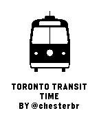
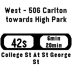
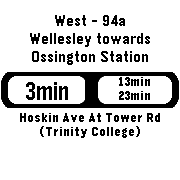

# Toronto Transit Time

A [Pebble](https://www.pebble.com/) application that shows bus/streetcar arrival time predictions for nearby stops in Toronto.

 &nbsp;  &nbsp; 

It supports all Pebble models - including [Pebble Time Round](https://www.pebble.com/pebble-time-round-smartwatch-features):

 &nbsp; 

### Download

[Click here](pebble://appstore/57315941c351ffcdf500000f) if you are on your mobile phone to install the watchapp.

If that doesn't work, try the [public link](https://apps.getpebble.com/en_US/application/57315941c351ffcdf500000f), or search for "Toronto Transit App" on the Pebble Time app.

In any case, there is no need to install any companion app, or preload/configure anything - just install and run.

### Structure

The `/app` directory contains:

- The C code of the main application that runs on Pebble (with separate files for the routes and predictions windows and layers, plus a splash screen layer that is shared among them).
- The JavaScript code that runs on the phone and provides location and internet API request/parsing services to the C app.

The `/server` directory contains a Rails app that:
- Pre-fetches the stops from the TTC system.
- Exposes an endpoint that receives a pair of coordinates and returns the closest stops and the routes served by each of those stops.

That back-end is used only to get the routes/stops list. Predictions and service messages are gathered directly from the TTC back-end.

### Thank you...

- [@bani](https://github.com/bani) for help with images, app name and Pebble development resources (not to mention having a physical Pebble Time Round, which forced me to support it 😭).
- [@cabello](https://github.com/cabello) for the JavaScript tips and contributions.
- People on the [pebbledev Slack](http://slack.pbldev.io/) for general guidance on my first Pebble app.
- [Toronto Transit Comission (TTC)](https://www.ttc.ca/), for offering a service I am pleased to use, and for publishing the APIs that made this application possible.

### License

Copyright (c) 2016 Carlos Duarte Do Nascimento

Permission is hereby granted, free of charge, to any person obtaining a copy of this software and associated documentation files (the "Software"), to deal in the Software without restriction, including without limitation the rights to use, copy, modify, merge, publish, distribute, sublicense, and/or sell copies of the Software, and to permit persons to whom the Software is furnished to do so, subject to the following conditions:

The above copyright notice and this permission notice shall be included in all copies or substantial portions of the Software.

THE SOFTWARE IS PROVIDED "AS IS", WITHOUT WARRANTY OF ANY KIND, EXPRESS OR IMPLIED, INCLUDING BUT NOT LIMITED TO THE WARRANTIES OF MERCHANTABILITY, FITNESS FOR A PARTICULAR PURPOSE AND NONINFRINGEMENT. IN NO EVENT SHALL THE AUTHORS OR COPYRIGHT HOLDERS BE LIABLE FOR ANY CLAIM, DAMAGES OR OTHER LIABILITY, WHETHER IN AN ACTION OF CONTRACT, TORT OR OTHERWISE, ARISING FROM, OUT OF OR IN CONNECTION WITH THE SOFTWARE OR THE USE OR OTHER DEALINGS IN THE SOFTWARE.

### Legal

The stop locations and predictions come from the [TTC Real-Time Next Arrival](http://www1.toronto.ca/wps/portal/contentonly?vgnextoid=4427790e6f21d210VgnVCM1000003dd60f89RCRD) service. The app or its authors do not have or claim to have any affiliation with the [Toronto Transit Commission (TTC)](https://www.ttc.ca/).

