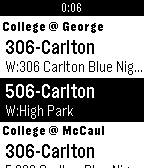
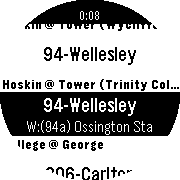

# Toronto Transit Time

A [Pebble](https://www.pebble.com/) application that shows bus/streetcar arrival time predictions for nearby stops in Toronto.

 &nbsp;  &nbsp; 

It supports all Pebble models - including [Pebble Time Round](https://www.pebble.com/pebble-time-round-smartwatch-features):

 &nbsp; 

### Download

[Click here](https://apps.getpebble.com/en_US/application/57315941c351ffcdf500000f) if you are on your mobile phone to install the watchapp (or just to get more info).

Alternatively, you can search for "Toronto Transit App" on the Pebble Time app.

In any case, there is no need to install any companion app, or preload/configure anything. Just install and run.

### Rationale and Development Process

This [blog post](https://chester.me/archives/2016/12/building-a-pebble-app-with-c-javascript-and-rails-toronto-transit-time/) is a deep dive on how the initial idea ended in this app, and on why things were done in this particular way.

### Structure

The [/app](app/) directory contains:

- The C code of the main application that runs on Pebble (with separate files for the routes and predictions windows and layers, plus a splash screen layer that is shared among them).
- The JavaScript code that runs on the phone and provides location and internet API request/parsing services to the C app.

The [/server](server/) directory contains a Rails app that:
- Pre-fetches the stops from the TTC system.
- Exposes an endpoint that receives a pair of coordinates and returns the closest stops and the routes served by each of those stops.

That back-end is used only to get the routes/stops list. Check [its README](server/README.md) for setup informaiton.

Predictions and service messages are gathered directly from the TTC back-end by the watch (from the C app, via the JavaScript app).

### Credits / Acknowledgements

- [@cabello](https://github.com/cabello) for the JavaScript tips and contributions.
- [@bwinton](https://github.com/bwinton) for the color icons.

### Also thank you...

- [@bani](https://github.com/bani) for help with images, app name and Pebble development resources (not to mention having a physical Pebble Time Round, which forced me to support it 😭).
- People on the [pebbledev Slack](http://slack.pbldev.io/) for general guidance on my first Pebble app.
- [Toronto Transit Comission (TTC)](https://www.ttc.ca/), for offering a service I am pleased to use, and for publishing the APIs that made this application possible.

### Legal

The stop locations and predictions come from the [TTC Real-Time Next Arrival](http://www1.toronto.ca/wps/portal/contentonly?vgnextoid=4427790e6f21d210VgnVCM1000003dd60f89RCRD) service. The app or its authors do not have or claim to have any affiliation with the [Toronto Transit Commission (TTC)](https://www.ttc.ca/).
